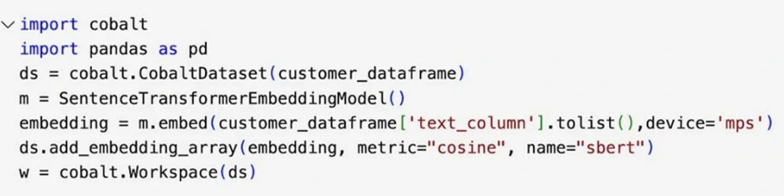
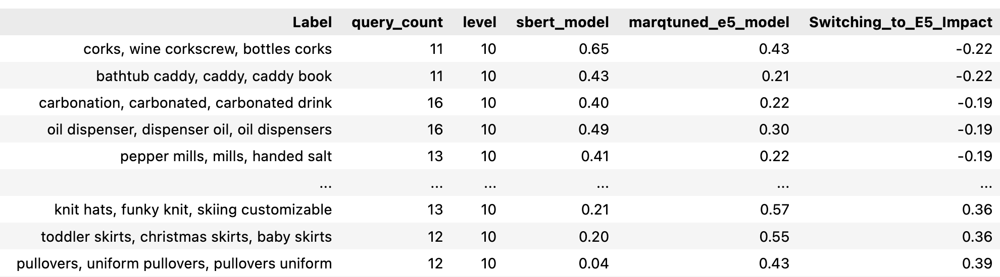
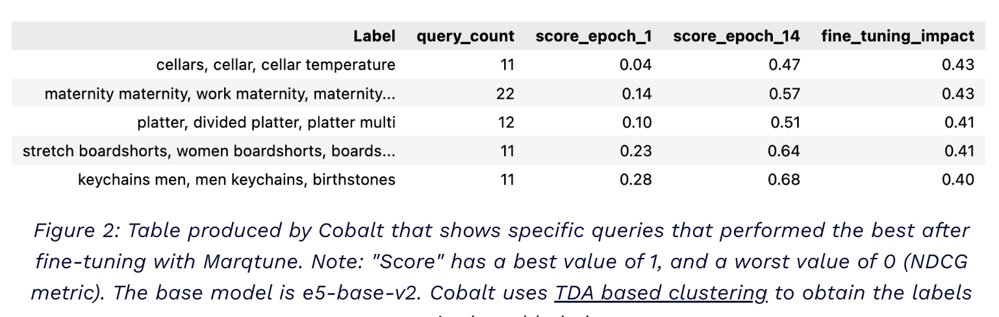
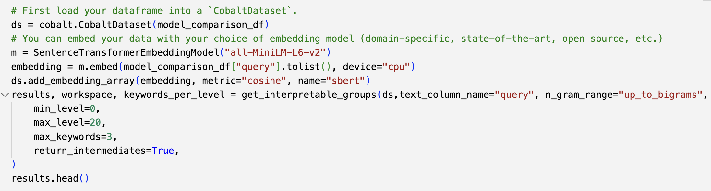

# BluelightAI

Welcome to [BluelightAI's](https://bluelightai.com/) GitHub! We build tools to
help AI developers illuminate and improve their models and data.

## Why Cobalt?

The time you have to understand and fix your model’s errors is limited,
expensive and hard to scale to the size of your dataset. Cobalt automates the
otherwise painful step of looking for patterns in how your models are
performing. We're here to make [topological data
analysis](https://www.nature.com/articles/srep01236) easy to use.

### Setup

For the latest instructions to [pip
install](https://pypi.org/project/cobalt-ai/) cobalt-ai for your environment,
visit our [docs](https://docs.cobalt.bluelightai.com/setup.html).

## Cobalt

BluelightAI Cobalt illuminates model errors and makes model performance
comparisons easy in Python:

- Easily [start analysis](https://docs.cobalt.bluelightai.com/) for a model or
  dataset with a few lines of code. Cobalt readily supports text, image, and
  tabular datasets.
  

- Automatically identify problematic groups of data in your model, saving days
  or weeks of troubleshooting effort. 

- Quickly compare models and assess the deployment risk of each model for your
  use case, like this case comparing embedding models for product search:

- Use the groups discovered by Cobalt to track the most important metrics for
  model improvement: curate your data, retrain, fine-tune, or develop intuitive
  test cases based on Cobalt's intelligent groups.

- Explore an interactive visualization of your dataset, model errors, or
  embedding model using our TDA-based dimensionality reduction:

### Generate a Table to Evaluate and Compare Models

## Community

- [Slack](https://join.slack.com/t/bluelightaicommunity/shared_invite/zt-2uj0iu5lh-5WgutuwH82RxAOwuq8ptqg)

- [Website](https://bluelightai.com)

- [LinkedIn](https://www.linkedin.com/company/bluelightai/)

- [YouTube](https://www.youtube.com/@bluelightai-il6mc)
